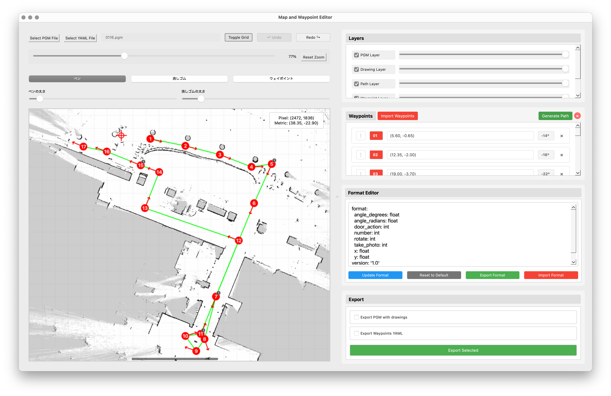
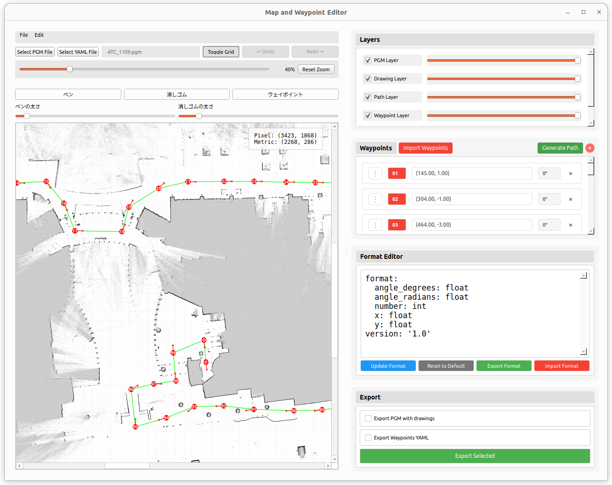

# Map and Waypoint Editor (AMR_TOOLKIT)

自律移動ロボット（ROS / ROS 2 / Nav2 等）向けの **2D占有格子地図（PGM）編集** および **ウェイポイント / ランドマーク管理** を行う GUI アプリケーションです。

---

## スクリーンショット

| Mac OS | Ubuntu 22.04 / 24.04 |
| :---: | :---: |
|  |  |

---

## 主な機能

- 🗺️ **地図編集 (PGM/YAML)**
  - PGM 形式の占有格子地図（SLAM生成地図など）の読み込み・保存
  - 障害物の追加（ペンツール）および消去・通路化（消しゴムツール）
  - 編集後の地図画像（.pgm）とメタデータ（.yaml: resolution, origin 等）の一括出力
- 📍 **ウェイポイント & ランドマーク管理**
  - クリック＆ドラッグで位置と進行方向（ヨー角）を直感的に配置
  - 移動（ドラッグ）、角度変更（Shift + ドラッグ）、削除、カスタム属性（アクション情報など）の編集
  - 経路リスト上でのドラッグ＆ドロップによる順序並べ替え
  - ウェイポイント間を結ぶ経路の自動可視化（Generate Path）
- 📐 **高精度な座標系変換**
  - 画像ピクセル座標とロボットの実世界メートル座標（[m]）のリアルタイム相互変換
  - カーソル位置の座標表示・グリッド（格子）表示
- 🎨 **マルチレイヤー管理**
  - 5階層レイヤー（ベース地図 / 描画 / パス / ウェイポイント / ランドマーク・原点）
  - レイヤーごとの表示/非表示切り替え、不透明度（0〜100%）調整
- 💾 **柔軟なエクスポート & インポート**
  - Waypoint / Landmark の YAML 形式エクスポートおよびインポート
  - フォーマットエディタによる出力 YAML 構造のカスタマイズ
- ↩️ **アンドゥ / リドゥ対応**
  - 編集履歴の管理（`Ctrl+Z` / `Ctrl+Shift+Z`）

---

## セットアップと実行

### 1. 環境構築

```bash
# リポジトリ直下に移動
cd /home/kotantu-desktop/AMR_TOOLKIT

# 仮想環境（venv）の作成と有効化
python3 -m venv venv
source venv/bin/activate

# 依存パッケージのインストール
pip install -r requirements.txt
```

### 2. アプリケーションの起動

以下のいずれかの方法で起動できます。

```bash
# 方法 A: 起動スクリプトを使用
./run_editor.sh

# 方法 B: Pythonで直接実行
source venv/bin/activate
python3 main_all.py

# 方法 C: ビルド済みバイナリを実行
./dist/WaypointEditor
```

### 3. バイナリのビルド (PyInstaller)

スタンドアロン実行可能ファイルを作成する場合：

```bash
source venv/bin/activate
pyinstaller WaypointEditor.spec --clean --noconfirm
```
ビルドが完了すると、`dist/WaypointEditor` に単一バイナリが生成されます。

---

## 詳しい使い方

### Step 1: 地図 (PGM / YAML) の読み込み
1. 画面上部の **`Select PGM File`** をクリックし、編集したい地図ファイル（例: `map.pgm`）を選択します。
2. 続けて **`Select YAML File`** をクリックし、地図の設定ファイル（例: `map.yaml`）を選択します。
   - 地図の解像度（`resolution`）や原点（`origin`）が読み込まれ、実世界座標（メートル）との変換が有効になります。

### Step 2: 地図の修正・レタッチ
- **ペンツール (Pen)**: 地図上に障害物を黒色で描画します（壁の補完など）。
- **消しゴムツール (Eraser)**: 地図上のゴミや不要な障害物を消去して白色（フリースペース）にします。
- **サイズ調整**: ペン/消しゴム選択時に表示されるスライダーでブラシサイズを変更できます。
- **Undo / Redo**: 画面上部のボタン、または `Ctrl+Z` / `Ctrl+Shift+Z` で操作を取り消し・再適用できます。

### Step 3: ウェイポイントの配置
1. ツールバーの **`Waypoint`** ボタンをクリックして配置モードにします。
2. 地図上の配置したい位置で **左クリックしたままドラッグ** します。
   - クリック位置が座標（$x, y$）、ドラッグする方向が進行方向（ヨー角 $\theta$）になります。
3. マウスを離すと、番号と矢印付きのウェイポイントが配置され、右側のリストに追加されます。

### Step 4: ウェイポイントの編集・並べ替え
- **位置の移動**: 地図上のマーカーを直接 **ドラッグ** して移動します。
- **角度の変更**: **`Shift` キーを押しながらドラッグ** すると、位置を変えずに角度のみを回転できます。
- **属性の編集**: マーカーを **右クリック** してメニューから編集を選択し、アクション情報（停止時間、速度制限など）を追加できます。
- **削除**: マーカーを右クリックして「削除」を選択するか、右側リストの各項目にある「×」ボタンを押します。
- **順序の並べ替え**: 右側パネルの **Waypoints リスト** 内で項目を **ドラッグ＆ドロップ** して通過順序を入れ替えます。

### Step 5: 経路（パス）の可視化
- 右側パネルの **`Generate Path`** ボタンをクリックすると、ウェイポイント間を結ぶ順路（緑色の実線）が表示されます。

### Step 6: データの保存・エクスポート
画面右下の **Export Panel** から用途に応じて保存します：
- **Export Waypoints**: 配置したウェイポイント群を YAML ファイルとして保存します。
- **Export Map**: 描画レイヤーを合成した最新の PGM 画像ファイルと、原点情報などを含んだ YAML ファイルを一括保存します。
- **Export Landmarks**: ランドマーク情報を YAML ファイルとして保存します。

---

## 操作・ショートカット一覧

| 操作 / ショートカット | 機能 |
| :--- | :--- |
| **左クリック ＋ ドラッグ** (Waypointモード) | ウェイポイントの新規配置（位置＋方向指定） |
| **マーカーをドラッグ** | 既存ウェイポイントの位置移動 |
| **`Shift` ＋ マーカーをドラッグ** | 既存ウェイポイントの角度（ヨー角）変更 |
| **マーカー上で右クリック** | コンテキストメニュー表示（編集 / 削除） |
| **マーカー上にマウスホバー** | ウェイポイントの属性・アクション情報のツールチップ表示 |
| **マウスホイール** | 地図の拡大 / 縮小（ズーム） |
| **`Ctrl + Z`** | アンドゥ（元に戻す） |
| **`Ctrl + Shift + Z`** | リドゥ（やり直し） |
| **`F11`** | 全画面表示の切り替え |
| **`Esc`** | 全画面表示の解除 |
| **Toggle Grid** ボタン | メッシュグリッド（格子）の表示 / 非表示 |
| **Reset Zoom** ボタン | ズーム倍率を 100%（初期状態）にリセット |

---

## データフォーマット仕様

### Waypoint YAML 出力例

```yaml
format_version: '1.0'
waypoints:
  - number: 1
    name: "Waypoint 1"
    x: 2.350          # 実世界 X 座標 [m]
    y: -1.120         # 実世界 Y 座標 [m]
    angle_degrees: 45.0
    angle_radians: 0.7854
    attributes:       # カスタム属性（設定した場合）
      action: "stop"
      duration: 5.0
  - number: 2
    name: "Waypoint 2"
    x: 5.400
    y: 3.210
    angle_degrees: 90.0
    angle_radians: 1.5708
```

---

## トラブルシューティング / 注意事項

- **Ubuntu / Wayland / HiDPI 環境でマウス位置がずれる場合**:
  Qtのプラットフォームプラグインを X11 (xcb) に切り替えるか、スケーリング設定を固定して起動してください：
  ```bash
  # X11プラットフォームで起動
  QT_QPA_PLATFORM=xcb python3 main_all.py

  # またはスケーリング無効化で起動
  QT_AUTO_SCREEN_SCALE_FACTOR=0 QT_SCALE_FACTOR=1 python3 main_all.py
  ```
