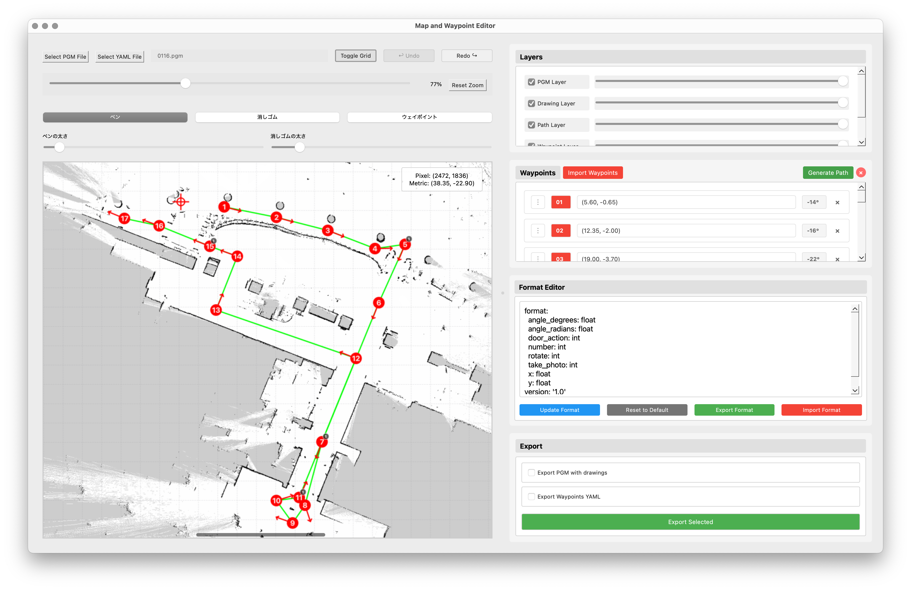
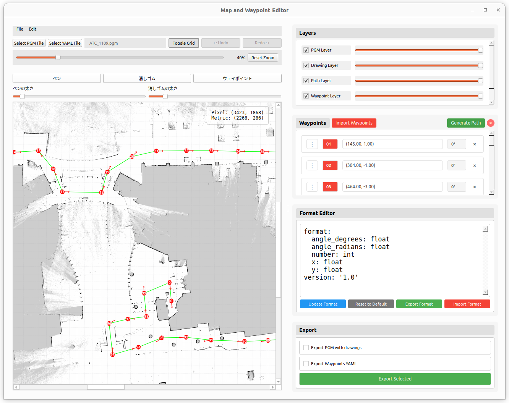

# Map and Waypoint Editor (AMR_TOOLKIT)

自律移動ロボット（ROS / ROS 2 / Nav2 等）向けの **2D占有格子地図（PGM）編集** および **ウェイポイント / ランドマーク管理** を行う GUI アプリケーションです。

---

## スクリーンショット

| Mac OS | Ubuntu 22.04 / 24.04 |
| :---: | :---: |
|  |  |

---

## 主な機能

- 🗺️ **地図編集 (PGM/YAML)**
  - PGM 形式の占有格子地図（SLAM生成地図など）の読み込み・保存
  - 障害物の追加（ペンツール）および消去・通路化（消しゴムツール）
  - 編集後の地図画像（.pgm）とメタデータ（.yaml: resolution, origin 等）の一括出力
- 📍 **ウェイポイント & ランドマーク管理**
  - クリック＆ドラッグで位置と進行方向（ヨー角）を直感的に配置
  - 移動（ドラッグ）、角度変更（Shift + ドラッグ）、削除、カスタム属性（アクション情報など）の編集
  - 経路リスト上でのドラッグ＆ドロップによる順序並べ替え
  - ウェイポイント間を結ぶ経路の自動可視化（Generate Path）
- 📐 **高精度な座標系変換**
  - 画像ピクセル座標とロボットの実世界メートル座標（[m]）のリアルタイム相互変換
  - カーソル位置の座標表示・グリッド（格子）表示
- 🎨 **マルチレイヤー管理**
  - 5階層レイヤー（ベース地図 / 描画 / パス / ウェイポイント / ランドマーク・原点）
  - レイヤーごとの表示/非表示切り替え、不透明度（0〜100%）調整
- 🧭 **セマンティックコスト（路面マップ）**
  - 路面マッピングの `.colored.pgm` + `.colored.json` を読み込み、`labels` の
    `global_cost` / `local_cost` を芝生・点字ブロック等のクラス別コストとして付与
  - コストマップを **コストペン/消しゴム**（クラス色 or 任意値）で手動編集（Undo/Redo対応）
  - クラス別コスト表と手動編集は同一のコストマップを共有し、
    障害物膨張（Nav2 inflation_layer 相当）と合成（Max / Add）してパス計画へ反映
  - 致死コスト（100=LETHAL）のセマンティック領域は障害物と同様に **膨張**（青→赤）される
  - クラスごとのコスト・合成方法・不透明度を右パネルから編集（100 = LETHAL）
- 💾 **柔軟なエクスポート & インポート**
  - Waypoint / Landmark の YAML 形式エクスポートおよびインポート
  - フォーマットエディタによる出力 YAML 構造のカスタマイズ
- ↩️ **アンドゥ / リドゥ対応**
  - 編集履歴の管理（`Ctrl+Z` / `Ctrl+Shift+Z`）

---

## セットアップと実行

### 1. 環境構築

```bash
# リポジトリ直下に移動
cd /home/kotantu-desktop/AMR_TOOLKIT

# 仮想環境（venv）の作成と有効化
python3 -m venv venv
source venv/bin/activate

# 依存パッケージのインストール
pip install -r requirements.txt
```

### 2. アプリケーションの起動

以下のいずれかの方法で起動できます。

```bash
# 方法 A: 起動スクリプトを使用
./run_editor.sh

# 方法 B: Pythonで直接実行
source venv/bin/activate
python3 main_all.py

# 方法 C: ビルド済みバイナリを実行
./dist/WaypointEditor
```

### 3. バイナリのビルド (PyInstaller)

スタンドアロン実行可能ファイルを作成する場合：

```bash
source venv/bin/activate
pyinstaller WaypointEditor.spec --clean --noconfirm
```
ビルドが完了すると、`dist/WaypointEditor` に単一バイナリが生成されます。

---

## 詳しい使い方

### Step 1: 地図 (PGM / YAML) の読み込み
1. 画面上部の **`Select PGM File`** をクリックし、編集したい地図ファイル（例: `map.pgm`）を選択します。
2. 続けて **`Select YAML File`** をクリックし、地図の設定ファイル（例: `map.yaml`）を選択します。
   - 地図の解像度（`resolution`）や原点（`origin`）が読み込まれ、実世界座標（メートル）との変換が有効になります。

### Step 2: 地図の修正・レタッチ
- **ペンツール (Pen)**: 地図上に障害物を黒色で描画します（壁の補完など）。
- **消しゴムツール (Eraser)**: 地図上のゴミや不要な障害物を消去して白色（フリースペース）にします。
- **サイズ調整**: ペン/消しゴム選択時に表示されるスライダーでブラシサイズを変更できます。
- **Undo / Redo**: 画面上部のボタン、または `Ctrl+Z` / `Ctrl+Shift+Z` で操作を取り消し・再適用できます。

### Step 3: ウェイポイントの配置
1. ツールバーの **`Waypoint`** ボタンをクリックして配置モードにします。
2. 地図上の配置したい位置で **左クリックしたままドラッグ** します。
   - クリック位置が座標（$x, y$）、ドラッグする方向が進行方向（ヨー角 $\theta$）になります。
3. マウスを離すと、番号と矢印付きのウェイポイントが配置され、右側のリストに追加されます。

### Step 4: ウェイポイントの編集・並べ替え
- **位置の移動**: 地図上のマーカーを直接 **ドラッグ** して移動します。
- **角度の変更**: **`Shift` キーを押しながらドラッグ** すると、位置を変えずに角度のみを回転できます。
- **属性の編集**: マーカーを **右クリック** してメニューから編集を選択し、アクション情報（停止時間、速度制限など）を追加できます。
- **削除**: マーカーを右クリックして「削除」を選択するか、右側リストの各項目にある「×」ボタンを押します。
- **順序の並べ替え**: 右側パネルの **Waypoints リスト** 内で項目を **ドラッグ＆ドロップ** して通過順序を入れ替えます。

### Step 5: 経路（パス）の可視化
- 右側パネルの **`Generate Path`** ボタンをクリックすると、ウェイポイント間を結ぶ順路（緑色の実線）が表示されます。

### Step 6: データの保存・エクスポート
画面右下の **Export Panel** から用途に応じて保存します：
- **Export Waypoints**: 配置したウェイポイント群を YAML ファイルとして保存します。
- **Export Map**: 描画レイヤーを合成した最新の PGM 画像ファイルと、原点情報などを含んだ YAML ファイルを一括保存します。
- **Export Landmarks**: ランドマーク情報を YAML ファイルとして保存します。

### Step 7: セマンティックコスト（芝生・点字ブロック等）
路面マッピングの色付き地図（`.colored.pgm` + `.colored.json`）を読み込むと、
右パネルに **Semantic Cost (Road Map)** が表示されます。

1. **Select Road Map** で `.colored.pgm`（または `.colored.json` / `.color.png`）を選択します。
   - `.colored.json` の `labels`（class 名 / `global_cost` / `local_cost`）からコストマップが生成され、
     右パネル（Semantic Cost）の表に並びます。
2. **Enable semantic cost** をオンにすると、クラス別コストを計画へ反映します。
   - 表示は **Layers** パネルの `Cost Map Layer`（COST_PEN/COST_ERASER で編集可能）で確認できます。
3. **Global / Local** の値を編集します（0 = コストなし、100 = LETHAL = 通行不可）。
   - 既定は `grass` = global 100（通行不可）、`tactile paving` = local 50（ソフトコスト）など。
   - 単一の計画グリッドでは安全側に倒して `max(global, local)` を採用します。
   - 編集すると `Cost Map Layer`（コストマップ）が同じ値で再生成されます。
4. **コストペン/消しゴム**（ツールバー）で個別セルを手動修正できます。
   - クラス色（ドロップダウン）か任意のコスト値（0-100）を塗れます。
   - 手動編集は同じコストマップに保存され、**パス計画にも直接反映**されます（Undo/Redo対応）。
   - クラス別コストを変更するとマップは再生成され、手動編集はいったんリセットされます。
5. **Combine with inflation** で障害物膨張との合成方法を選びます。
   - `Max`（推奨）: 膨張コストとセマンティックコストの大きい方を採用。
   - `Add`: 両者を加算（上限254）。
   - 致死コスト（100=LETHAL）のセマンティック領域（芝生・車道など）は
     障害物と同様に膨張源となり、周囲に青→赤の膨張コストが生成されます
     （膨張オーバーレイを表示するには `Obstacle Inflation` をONにしてください）。
6. **Generate Path** でパスを生成すると、芝生（LETHAL）を避け、点字ブロック
   （ソフトコスト）は許容しつつコストの低い経路が選ばれます。
7. **Opacity** でコストマップの不透明度、**Reset to road map defaults** で
   `.colored.json` の値に戻せます。

> 補足: `.colored.json` に `labels`（コスト）が無い旧形式の地図では、
> 表示のみでセマンティックコストは付与できません。

---

## 操作・ショートカット一覧

| 操作 / ショートカット | 機能 |
| :--- | :--- |
| **左クリック ＋ ドラッグ** (Waypointモード) | ウェイポイントの新規配置（位置＋方向指定） |
| **マーカーをドラッグ** | 既存ウェイポイントの位置移動 |
| **`Shift` ＋ マーカーをドラッグ** | 既存ウェイポイントの角度（ヨー角）変更 |
| **マーカー上で右クリック** | コンテキストメニュー表示（編集 / 削除） |
| **マーカー上にマウスホバー** | ウェイポイントの属性・アクション情報のツールチップ表示 |
| **マウスホイール** | 地図の拡大 / 縮小（ズーム） |
| **`Ctrl + Z`** | アンドゥ（元に戻す） |
| **`Ctrl + Shift + Z`** | リドゥ（やり直し） |
| **`F11`** | 全画面表示の切り替え |
| **`Esc`** | 全画面表示の解除 |
| **Toggle Grid** ボタン | メッシュグリッド（格子）の表示 / 非表示 |
| **Reset Zoom** ボタン | ズーム倍率を 100%（初期状態）にリセット |

---

## データフォーマット仕様

### Waypoint YAML 出力例

```yaml
format_version: '1.0'
waypoints:
  - number: 1
    x: 2.350
    y: -1.120
    angle_radians: 0.785
  - number: 2
    x: 5.400
    y: 3.210
    angle_radians: 1.571
    person_area: true
```

アクション項目は、デフォルト値から変更されたものだけがウェイポイントごとに出力されます。

---

## トラブルシューティング / 注意事項

- **Ubuntu / Wayland / HiDPI 環境でマウス位置がずれる場合**:
  Qtのプラットフォームプラグインを X11 (xcb) に切り替えるか、スケーリング設定を固定して起動してください：
  ```bash
  # X11プラットフォームで起動
  QT_QPA_PLATFORM=xcb python3 main_all.py

  # またはスケーリング無効化で起動
  QT_AUTO_SCREEN_SCALE_FACTOR=0 QT_SCALE_FACTOR=1 python3 main_all.py
  ```
