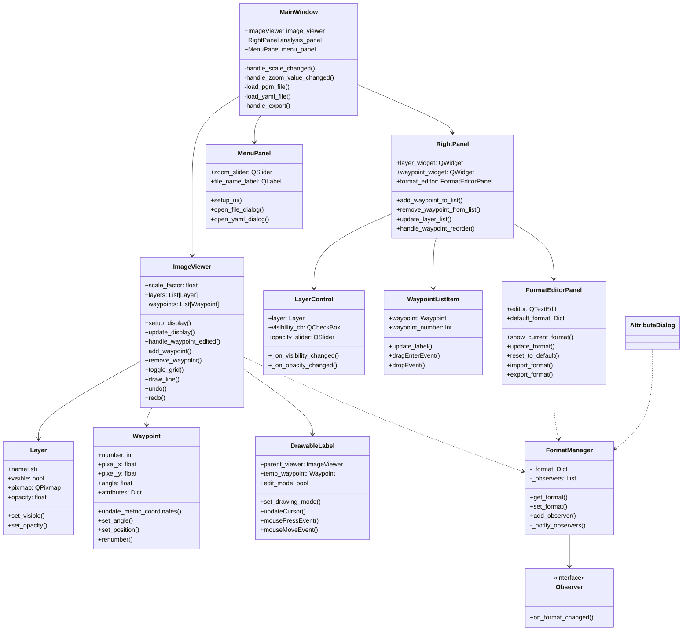
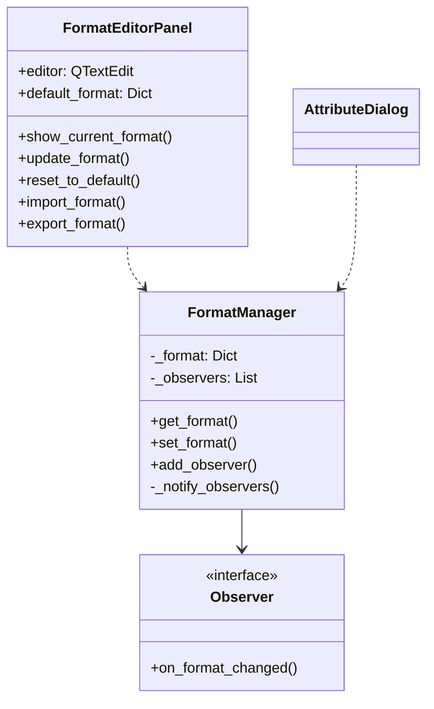
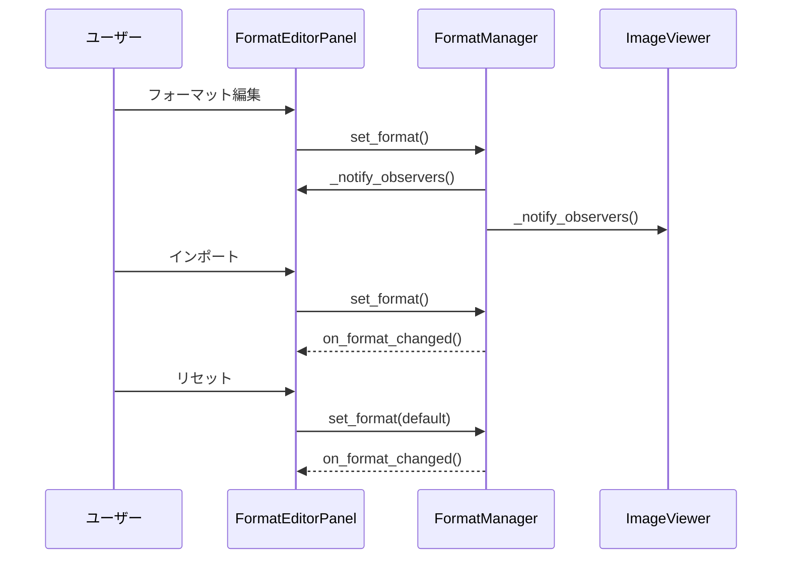
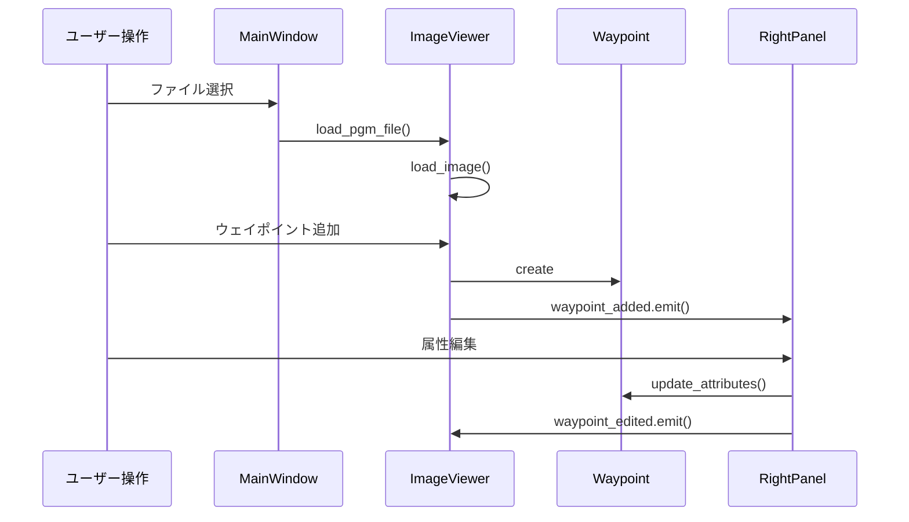
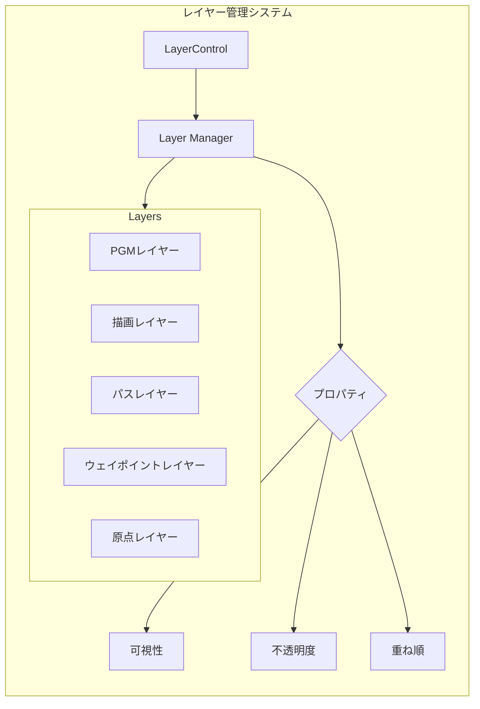
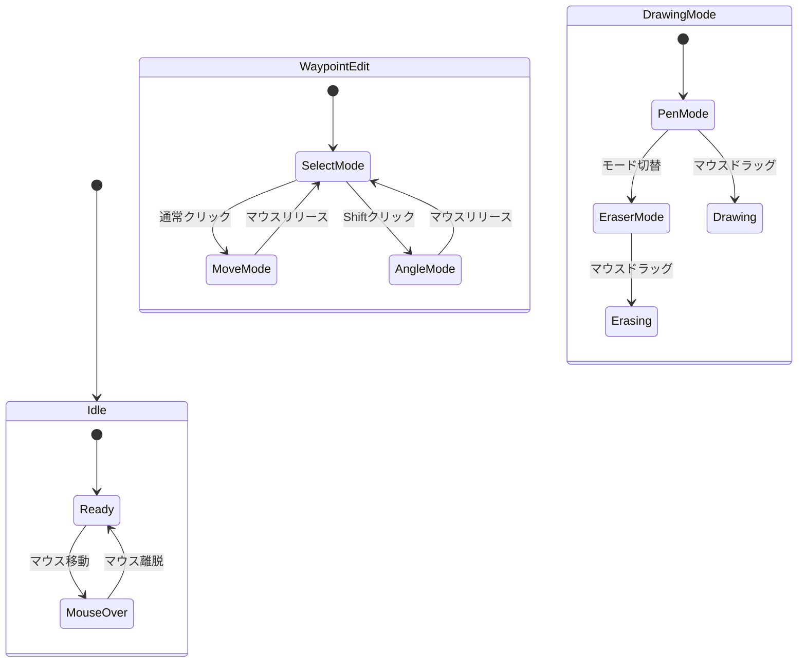

# 詳細システム構造

## システムの全体像とデータの流れ

本システムは、ロボットの経路設計のためのマップエディタとして機能します。

### 1. 画像の読み込みと表示の流れ

処理フロー:
1. ユーザーがMenuPanelでPGMファイルを選択
   - `MenuPanel.open_file_dialog()`で選択UI表示
   - `file_selected`シグナルでMainWindowに通知

2. MainWindowがファイルを読み込み、ImageViewerに転送
   - `MainWindow.load_pgm_file()`でバイナリ読み込み
   - PGMフォーマット検証（P5形式）
   - numpy arrayに変換

3. ImageViewerが画像をPGMレイヤーとして表示
   - `ImageViewer.load_image()`でQPixmapに変換
   - PGMレイヤーに割り当て
   - スケーリングして表示更新

4. YAMLファイルから設定読み込み
   - `load_yaml_file()`で原点情報取得
   - resolution値の設定
   - 座標系の変換行列生成

根拠コード:
```python
def load_pgm_file(self, file_path):
    with open(file_path, 'rb') as f:
        magic = f.readline().decode('ascii').strip()
        if (magic != 'P5'):
            raise ValueError('Not a P5 PGM file')
        # ...
```

### 2. ウェイポイントの作成と編集フロー

1. ウェイポイントモード選択
   - `ImageViewer.set_drawing_mode(DrawingMode.WAYPOINT)`
   - カーソルをクロスに変更
   - スクロール制御を無効化

2. マップ上でクリックしてウェイポイント作成
   - `DrawableLabel.mousePressEvent()`でクリック検知
   - `ImageViewer.add_waypoint()`で新規Waypointオブジェクト生成
   - ピクセル座標からメートル座標に変換

3. ドラッグで方向設定
   - `mouseMoveEvent()`で角度を計算
   - Y軸を反転して実世界座標系に合わせる
   - プレビュー表示を更新

4. RightPanelのリスト追加
   - `waypoint_added`シグナルで通知
   - `WaypointListItem`を生成
   - ドラッグ&ドロップ用の設定

根拠コード:
```python
def add_waypoint(self, pos):
    # ピクセル座標の取得と変換
    scale_x = self.pgm_layer.pixmap.width() / pixmap_geometry.width()
    x = int(pos.x() * scale_x)
    y = int(pos.y() * scale_y)
    
    waypoint = Waypoint(x, y)
    if self.origin_point:
        waypoint.update_metric_coordinates(...)
```

### 3. レイヤー管理システム

システムは5つのレイヤーを重ね合わせて表示を管理：

1. PGMレイヤー（最下層）：元の地図画像
2. 描画レイヤー：ユーザーによる描画内容
3. パスレイヤー：ウェイポイント間の経路
4. ウェイポイントレイヤー：各ウェイポイントの表示
5. 原点レイヤー（最上層）：座標系の原点マーカー

各レイヤーは個別に表示/非表示の切り替えと透明度の調整が可能です。

### 4. フォーマット管理システム

フォーマット管理は以下の流れで行われます：

1. FormatManagerが基本フォーマットを保持
2. FormatEditorPanelでユーザーがフォーマットを編集
3. 変更はObserverパターンで各コンポーネントに通知
4. AttributeDialogで各ウェイポイントに属性を設定

### 5. データの永続化

データの保存と読み込みは以下の形式で行われます：

1. 画像データ：PGMフォーマット
2. 設定情報：YAMLフォーマット
   - 原点情報
   - 解像度
   - その他のマップ属性
3. ウェイポイントデータ：YAMLフォーマット
   - 位置情報
   - 角度情報
   - カスタム属性

### 6. エラー処理とデータ検証

システムは以下の段階でエラーチェックを行います：

1. ファイル読み込み時
   - フォーマットの検証
   - データの整合性チェック
2. ウェイポイント作成時
   - 座標値の範囲チェック
   - 必須属性の存在確認
3. フォーマット更新時
   - 構文チェック
   - 必須キーの存在確認

## アクセス修飾子について

クラス図で使用される可視性記号の意味は以下の通りです：

- `+` (パブリック)
    - クラスの外部からアクセス可能なメンバー

- `-` (プライベート)
    - そのクラス内でのみアクセス可能なメンバー

- `#` (プロテクテッド)
    - そのクラスと派生クラスからアクセス可能なメンバー

- `~` (パッケージ)
    - 同じパッケージ内からアクセス可能なメンバー

## 1. クラス間の依存関係


## 1.1 主要な相互作用フロー

### 1.1.1 画像操作関連
- MainWindow
  - MenuPanelを通じてファイル選択を受け付け
  - ImageViewerに画像読み込みを指示
  - スケール変更をImageViewerとMenuPanel間で同期

### 1.1.2 レイヤー管理関連
- ImageViewer
  - 複数のLayerを管理（PGM, Drawing, Waypoint等）
  - レイヤーの状態変更をRightPanelに通知
- RightPanel
  - LayerControlを通じて各レイヤーの表示/非表示を制御
  - 不透明度の調整をImageViewerに反映

### 1.1.3 ウェイポイント管理関連
- ImageViewer
  - DrawableLabelを通じてウェイポイントの追加/編集を受け付け
  - Waypointオブジェクトの生成と管理
- RightPanel
  - WaypointListItemを通じてウェイポイントの一覧表示
  - ドラッグ&ドロップによる順序変更をImageViewerに通知

### 1.1.4 フォーマット管理関連
- FormatManager
  - ウェイポイントのフォーマット定義を一元管理
  - ImageViewerとRightPanelで共有
- FormatEditorPanel
  - フォーマットの編集UIを提供
  - 変更をFormatManagerに通知

### 1.1.4 フォーマット管理関連の詳細


### フォーマット管理システムの動作フロー


## 2. シグナル・スロット詳細フロー


## 3. レイヤーシステムの詳細構造


## 4. データ保存形式の詳細
### 4.1 ウェイポイントYAML形式
```yaml
format_version: '1.0'
waypoints:
  - number: 1
    x: 10.5
    y: 20.3
    angle_degrees: 45.0
    angle_radians: 0.785
    actions:
      - type: "move_forward"
        distance: 1.0
      - type: "turn"
        angle: 90.0

  - number: 2
    x: 15.2
    y: 25.8
    angle_degrees: 90.0
    angle_radians: 1.571
    actions:
      - type: "pause"
        duration: 5.0
```

## 5. イベント処理の詳細フロー


## 6. エラー処理フロー
```mermaid
graph TB
    Error[エラー発生] --> Type{種類判定}
    
    Type -->|ファイル| FileError[ファイルエラー]
    Type -->|フォーマット| FormatError[フォーマットエラー]
    Type -->|操作| OperationError[操作エラー]
    
    FileError --> FL{レベル判定}
    FL -->|Critical| FC[致命的]
    FL -->|Warning| FW[警告]
    
    FormatError --> FE{検証}
    FE -->|Invalid| FEI[無効なフォーマット]
