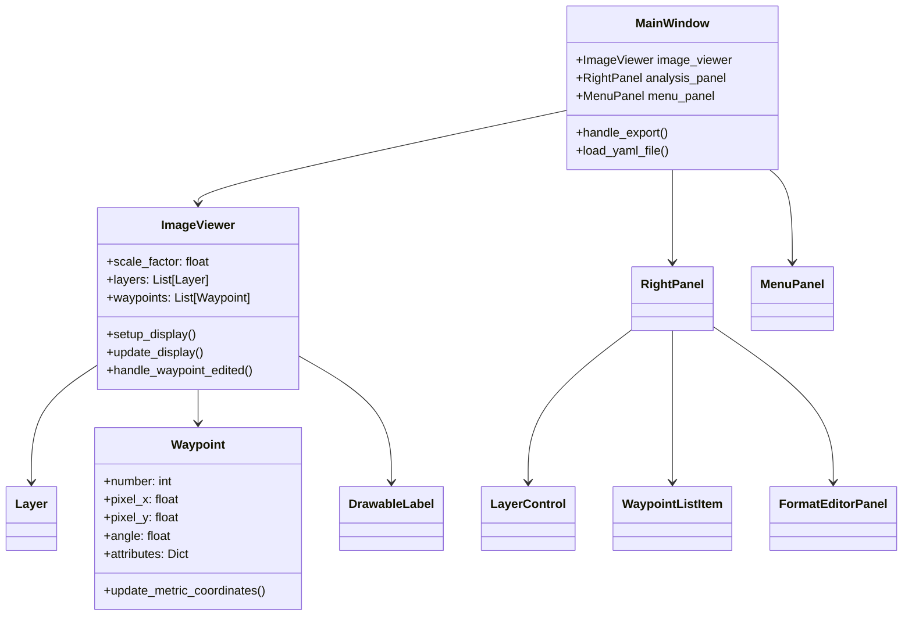
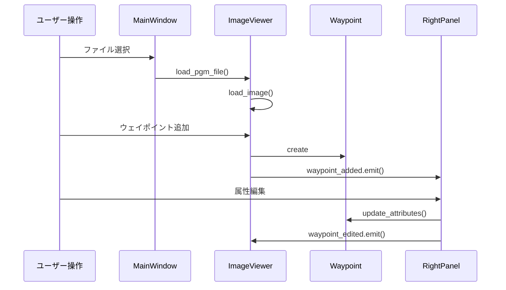
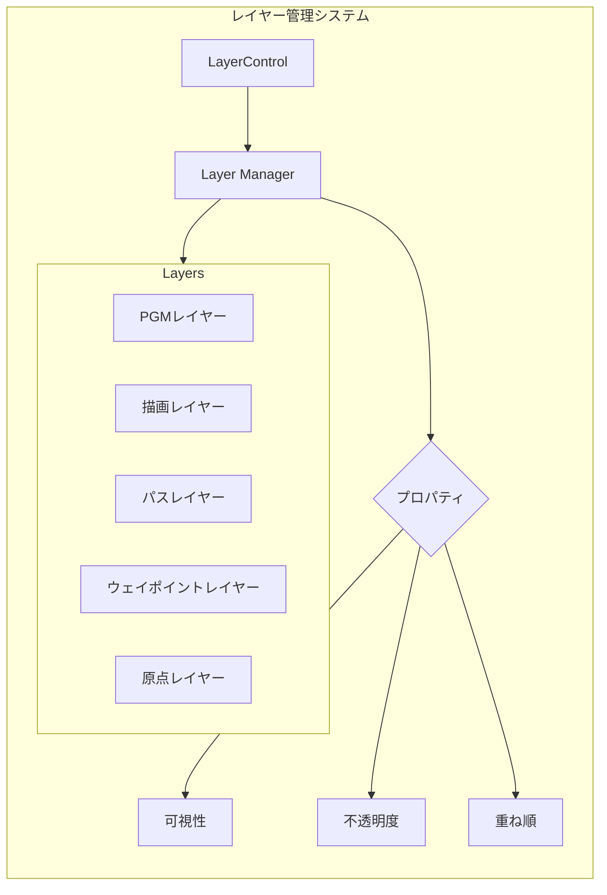
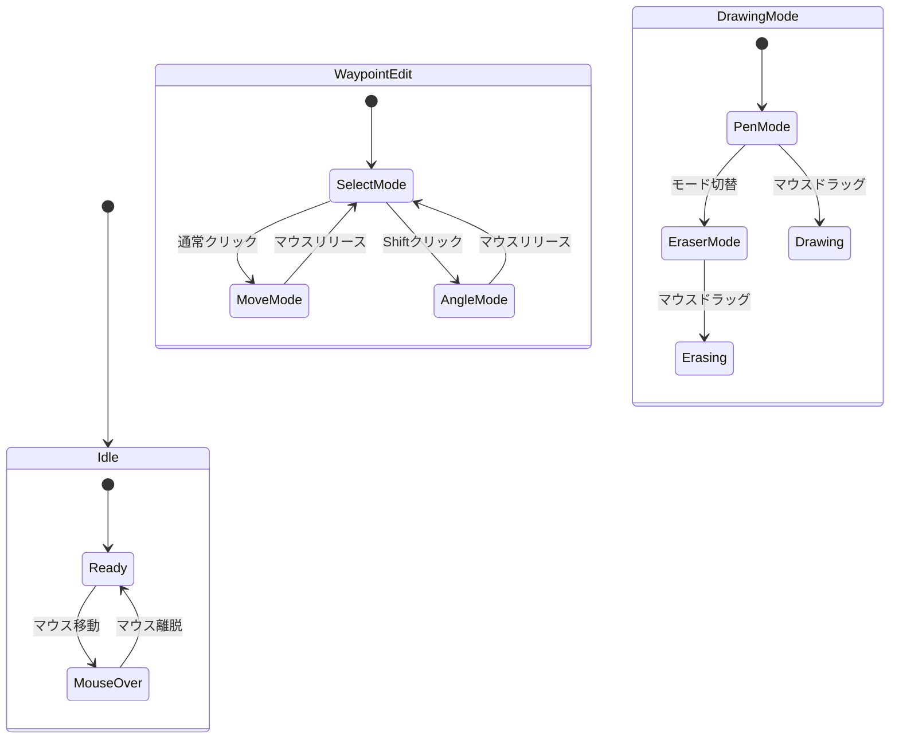

# 詳細システム構造

## 1. クラス間の依存関係


## 2. シグナル・スロット詳細フロー


## 3. レイヤーシステムの詳細構造


## 4. データ保存形式の詳細
### 4.1 ウェイポイントYAML形式
```yaml
format_version: '1.0'
waypoints:
  - number: 1
    x: 10.5
    y: 20.3
    angle_degrees: 45.0
    angle_radians: 0.785
    actions:
      - type: "move_forward"
        distance: 1.0
      - type: "turn"
        angle: 90.0

  - number: 2
    x: 15.2
    y: 25.8
    angle_degrees: 90.0
    angle_radians: 1.571
    actions:
      - type: "pause"
        duration: 5.0
```

## 5. イベント処理の詳細フロー


## 6. エラー処理フロー
```mermaid
graph TB
    Error[エラー発生] --> Type{種類判定}
    
    Type -->|ファイル| FileError[ファイルエラー]
    Type -->|フォーマット| FormatError[フォーマットエラー]
    Type -->|操作| OperationError[操作エラー]
    
    FileError --> FL{レベル判定}
    FL -->|Critical| FC[致命的]
    FL -->|Warning| FW[警告]
    
    FormatError --> FE{検証}
    FE -->|Invalid| FEI[無効なフォーマット]
