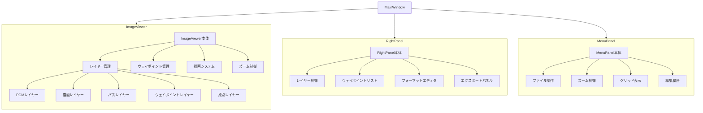
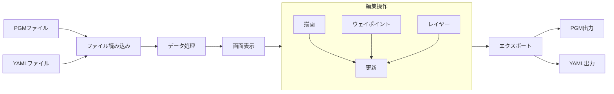
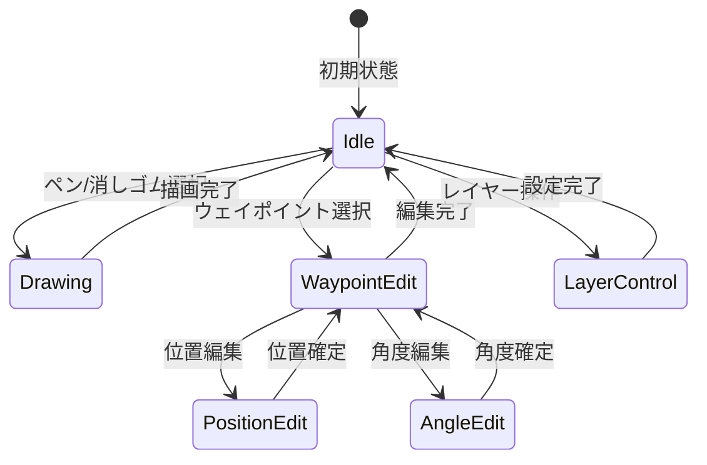
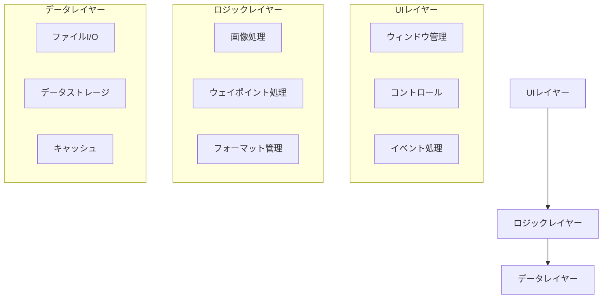
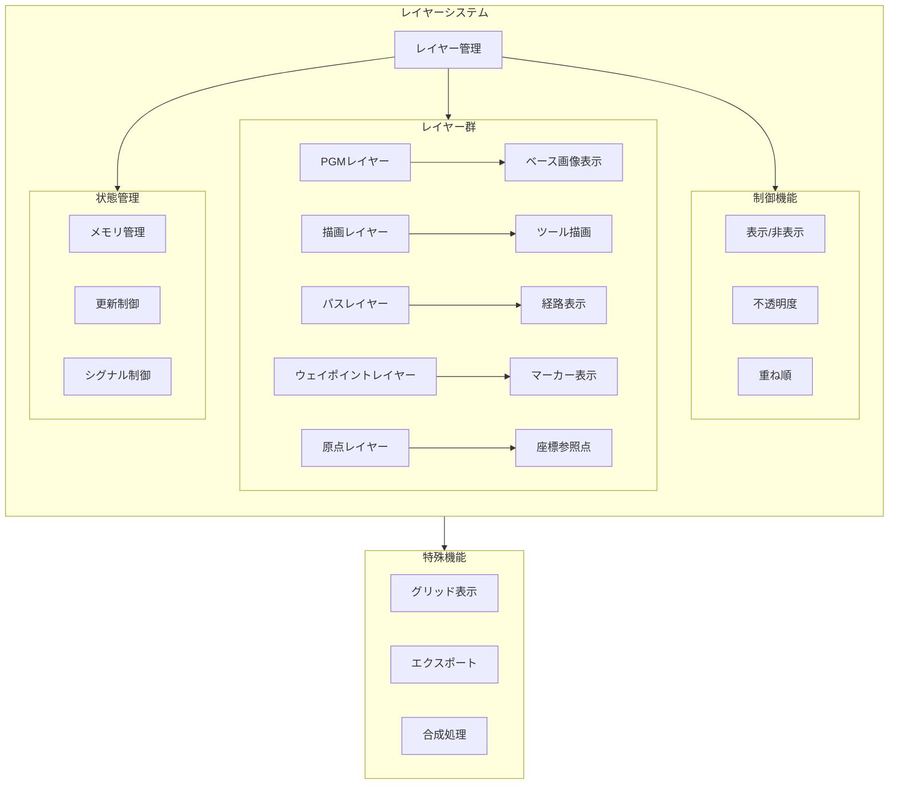
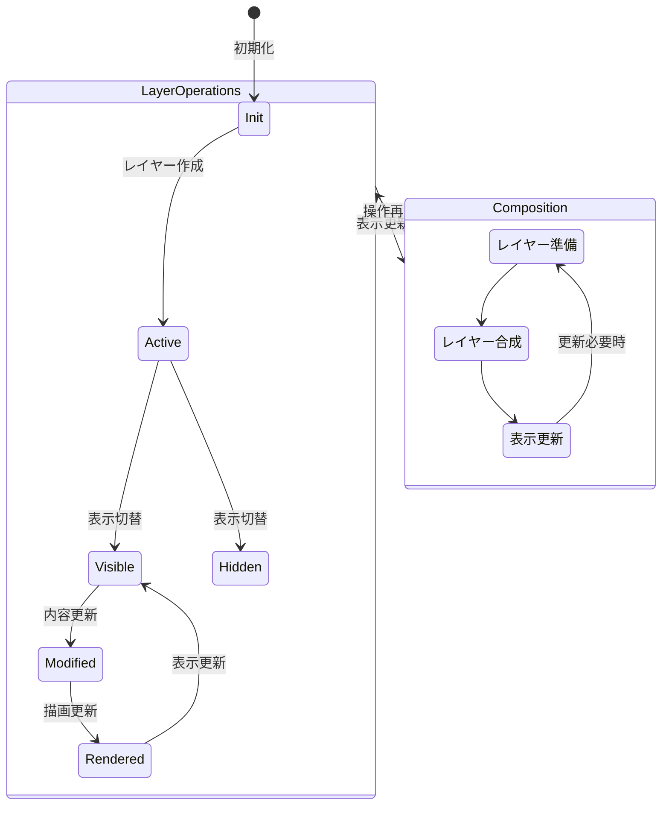
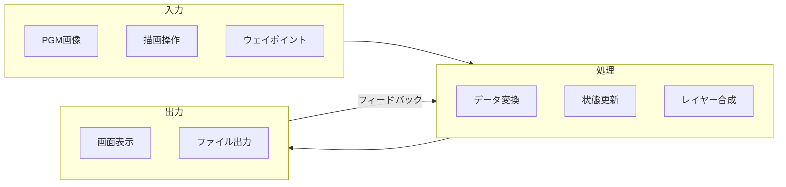

# システム構造図

## コンポーネント関係図

```mermaid
graph TB
    MainWindow --> ImageViewer
    MainWindow --> RightPanel
    MainWindow --> MenuPanel

    subgraph ImageViewer [ImageViewer]
        direction TB
        IV[ImageViewer本体] --> Layer[レイヤー管理]
        IV --> WP[ウェイポイント管理]
        IV --> Draw[描画システム]
        IV --> Zoom[ズーム制御]
        
        Layer --> PGM[PGMレイヤー]
        Layer --> Drawing[描画レイヤー]
        Layer --> Path[パスレイヤー]
        Layer --> WPLayer[ウェイポイントレイヤー]
        Layer --> Origin[原点レイヤー]
    end

    subgraph RightPanel [RightPanel]
        direction TB
        RP[RightPanel本体] --> LC[レイヤー制御]
        RP --> WPL[ウェイポイントリスト]
        RP --> FE[フォーマットエディタ]
        RP --> EP[エクスポートパネル]
    end

    subgraph MenuPanel [MenuPanel]
        direction TB
        MP[MenuPanel本体] --> File[ファイル操作]
        MP --> ZC[ズーム制御]
        MP --> Grid[グリッド表示]
        MP --> History[編集履歴]
    end
```

## データフロー図

```mermaid
flowchart LR
    PGM[PGMファイル] --> Load[ファイル読み込み]
    YAML[YAMLファイル] --> Load
    
    Load --> Process[データ処理]
    Process --> Display[画面表示]
    
    subgraph Edit [編集操作]
        Draw[描画] --> Update[更新]
        WP[ウェイポイント] --> Update
        Layer[レイヤー] --> Update
    end
    
    Display --> Edit
    Edit --> Export[エクスポート]
    
    Export --> OutPGM[PGM出力]
    Export --> OutYAML[YAML出力]
```

## イベント処理フロー

```mermaid
stateDiagram-v2
    [*] --> Idle: 初期状態
    
    Idle --> Drawing: ペン/消しゴム選択
    Drawing --> Idle: 描画完了
    
    Idle --> WaypointEdit: ウェイポイント選択
    WaypointEdit --> PositionEdit: 位置編集
    WaypointEdit --> AngleEdit: 角度編集
    PositionEdit --> WaypointEdit: 位置確定
    AngleEdit --> WaypointEdit: 角度確定
    WaypointEdit --> Idle: 編集完了
    
    Idle --> LayerControl: レイヤー操作
    LayerControl --> Idle: 設定完了
```

## システムアーキテクチャ

```mermaid
graph TB
    UI[UIレイヤー] --> Logic[ロジックレイヤー]
    Logic --> Data[データレイヤー]
    
    subgraph UIレイヤー
        Windows[ウィンドウ管理]
        Controls[コントロール]
        Events[イベント処理]
    end
    
    subgraph ロジックレイヤー
        ImageProcess[画像処理]
        WaypointLogic[ウェイポイント処理]
        Format[フォーマット管理]
    end
    
    subgraph データレイヤー
        FileIO[ファイルI/O]
        Storage[データストレージ]
        Cache[キャッシュ]
    end
```

## レイヤーシステム構造図

```mermaid
graph TB
    subgraph LayerSystem[レイヤーシステム]
        direction TB
        Manager[レイヤー管理] --> Layers
        Manager --> Controls
        Manager --> States

        subgraph Layers[レイヤー群]
            PGM[PGMレイヤー] --> Base[ベース画像表示]
            Draw[描画レイヤー] --> Tools[ツール描画]
            Path[パスレイヤー] --> Routes[経路表示]
            WP[ウェイポイントレイヤー] --> Markers[マーカー表示]
            Origin[原点レイヤー] --> Reference[座標参照点]
        end

        subgraph Controls[制御機能]
            Visibility[表示/非表示]
            Opacity[不透明度]
            Order[重ね順]
        end

        subgraph States[状態管理]
            Memory[メモリ管理]
            Update[更新制御]
            Signal[シグナル制御]
        end
    end

    subgraph Features[特殊機能]
        Grid[グリッド表示]
        Export[エクスポート]
        Composite[合成処理]
    end

    LayerSystem --> Features
```

## レイヤー操作フロー

```mermaid
stateDiagram-v2
    [*] --> Init: 初期化
    
    state LayerOperations {
        Init --> Active: レイヤー作成
        Active --> Visible: 表示切替
        Active --> Hidden: 表示切替
        Visible --> Modified: 内容更新
        Modified --> Rendered: 描画更新
        Rendered --> Visible: 表示更新
    }
    
    state Composition {
        Preparation: レイヤー準備
        Merge: レイヤー合成
        Display: 表示更新
        
        Preparation --> Merge
        Merge --> Display
        Display --> Preparation: 更新必要時
    }
    
    LayerOperations --> Composition: 表示更新時
    Composition --> LayerOperations: 操作再開
```

## レイヤーデータフロー

```mermaid
flowchart LR
    subgraph Input [入力]
        PGM[PGM画像]
        Draw[描画操作]
        WP[ウェイポイント]
    end

    subgraph Process [処理]
        Convert[データ変換]
        Update[状態更新]
        Composite[レイヤー合成]
    end

    subgraph Output [出力]
        Display[画面表示]
        Export[ファイル出力]
    end

    Input --> Process
    Process --> Output
    Output -- フィードバック --> Process
```
